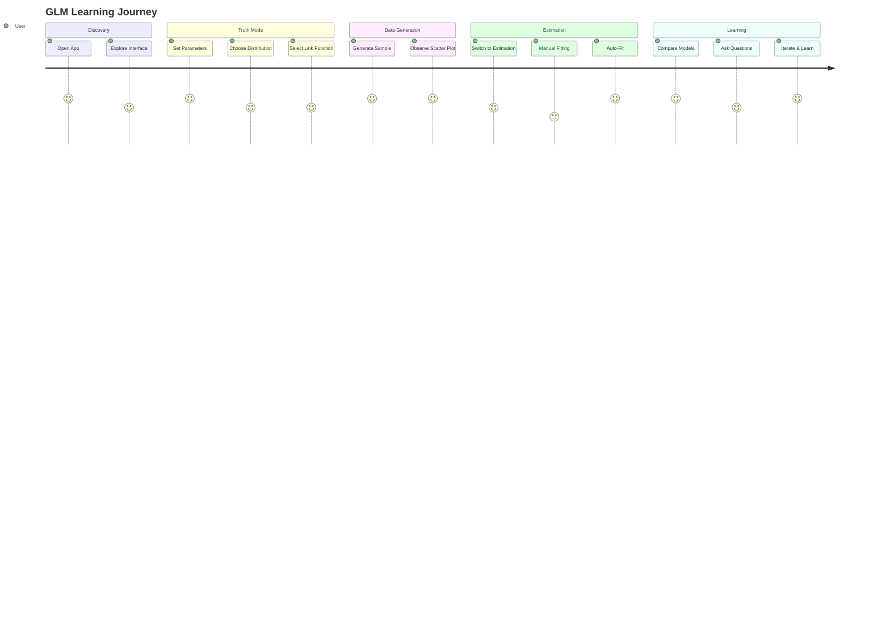
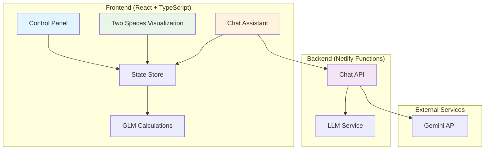
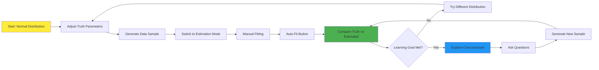

# Interactive GLM Learning Sandbox

## Table of Contents

- [1. Overview](#1-overview)
- [2. Goals & Objectives](#2-goals--objectives)
- [3. Target Audience](#3-target-audience)
- [4. Core Features & Functional Requirements](#4-core-features--functional-requirements)
  - [4.1. The Main Interface: GLM Sandbox](#41-the-main-interface-glm-sandbox)
  - [4.2. "Truth" Mode - Defining the Model](#42-truth-mode---defining-the-model)
  - [4.3. Data Generation](#43-data-generation)
  - [4.4. "Estimation" Mode - Fitting a Model](#44-estimation-mode---fitting-a-model)
  - [4.5. The "Two Spaces" Visualization](#45-the-two-spaces-visualization)
  - [4.6. Integrated Chat Assistant](#46-integrated-chat-assistant)
- [5. Technical Specifications](#5-technical-specifications)
  - [5.1. Frontend](#51-frontend)
  - [5.2. Backend](#52-backend)
  - [5.3. State Management](#53-state-management)
  - [5.4. Deployment](#54-deployment)
- [6. Project Scaffolding](#6-project-scaffolding)
- [7. User Flow](#7-user-flow)
- [8. Success Metrics](#8-success-metrics)
- [9. Future Enhancements](#9-future-enhancements)

## 1. Overview

This document outlines the requirements for the Interactive GLM Learning Sandbox, a single-page web application designed to make the concepts behind Generalized Linear Models (GLMs) intuitive and accessible. The application will combine a data generation sandbox with a "Two Spaces" visualization, allowing users to define a "true" statistical model, generate data from it, and then attempt to recover the original model parameters. This hands-on process demystifies the relationship between the linear predictor, link functions, and the response variable's distribution. The app will be a Progressive Web App (PWA) and will include a context-aware chat assistant to help users with concepts and functionality.

### User Journey Overview



## 2. Goals & Objectives

### Primary Goal
To create an intuitive, interactive tool that builds a deep, conceptual understanding of how GLMs work.

### Learning Objectives
- To illustrate the distinct roles of the Random Component, Systematic Component, and Link Function.
- To demonstrate the concept of sampling variability and its effect on model estimation.
- To show how a linear model can be used to model non-linear relationships via a link function.

### Technical Objectives
- To build a modern, performant, and responsive PWA using React, Vite, and TypeScript.
- To ensure a seamless deployment process via Netlify.
- To integrate an AI chat assistant for on-demand user support.

## 3. Target Audience

- **Data Science & Statistics Students:** University or online course students who need a visual aid to supplement theoretical learning.
- **Aspiring Data Analysts/Scientists:** Self-learners and professionals transitioning into data roles who want to solidify their understanding of fundamental modeling concepts.
- **Educators & Instructors:** Teachers looking for an interactive tool to use in lectures, workshops, or as a homework aid.

## 4. Core Features & Functional Requirements

### 4.1. The Main Interface: GLM Sandbox

The application will consist of a single, unified view divided into three main sections: a control panel on the left, and the "Two Spaces" visualization area on the right.

- **Layout:** A responsive two-column layout. The left column will house the control panel, and the right will contain the two visualization plots stacked vertically.
- **Modes:** The control panel will have a toggle to switch between "Truth" mode and "Estimation" mode.

### 4.2. "Truth" Mode - Defining the Model

In this mode, the user defines the ground truth of the data-generating process.

**User Story:** "As a learner, I want to define the parameters of a perfect GLM so I can see its theoretical form."

**Controls:**
- **True Intercept (beta_0) Slider:** Allows setting the true intercept value.
- **True Slope (beta_1) Slider:** Allows setting the true slope value.
- **Distribution Dropdown:** Select the Random Component (e.g., Poisson, Bernoulli, Normal).
- **Link Function Dropdown:** Select the link function (e.g., log, logit, identity). The available options should intelligently update based on the selected distribution.

**Visualization:** The "Two Spaces" view will display the perfect model based on these settings in a distinct color (e.g., orange).

### 4.3. Data Generation

**User Story:** "As a learner, I want to generate a random dataset from my 'true' model to see how real-world data includes noise."

**Controls:**
- **"Generate Data" Button:** When clicked, the app will generate a set of data points based on the "Truth" settings.
- **Sample Size Input:** A number input to control how many data points are generated.

**Functionality:** The generated data points will appear as a scatter plot on the "Response Space" visualization. Each click on "Generate Data" will create a new random sample.

### 4.4. "Estimation" Mode - Fitting a Model

In this mode, the user attempts to fit a new model to the generated data.

**User Story:** "As a statistician, I want to fit a new model to the generated data to see how close I can get to recovering the 'truth'."

**Controls:**
- **Estimated Intercept (hatbeta_0) Slider:** Allows manual adjustment of the estimated model's intercept.
- **Estimated Slope (hatbeta_1) Slider:** Allows manual adjustment of the estimated model's slope.
- **"Auto-Fit" Button:** Automatically calculates the maximum likelihood estimates for the intercept and slope, snapping the model to the best fit.

**Visualization:** The estimated model will be overlaid on the "Two Spaces" view in a different color (e.g., blue) to allow for direct comparison with the orange "Truth" model.

### 4.5. The "Two Spaces" Visualization

This is the core visual component, always visible and updating in real-time.

**Plot 1: Linear Predictor Space (eta)**
- **X-axis:** Predictor variable X.
- **Y-axis:** Linear predictor η = β₀ + β₁X.
- **Content:** Displays the model as a straight line. Both the "Truth" and "Estimated" lines will be shown here.

**Plot 2: Response Space (mu)**
- **X-axis:** Predictor variable X.
- **Y-axis:** Response variable Y.
- **Content:** Displays the generated data as a scatter plot. The fitted mean curve μ = g⁻¹(η) is overlaid. Both "Truth" and "Estimated" curves are shown. This curve will be non-linear for links like logit or log.

### GLM Data Flow Architecture

```mermaid
flowchart TD
    A[User Sets Truth Parameters] --> B[β₀, β₁, Distribution, Link]
    B --> C[Linear Predictor η = β₀ + β₁X]
    C --> D[Link Function g]
    D --> E[Mean μ = g⁻¹(η)]
    E --> F[Random Component]
    F --> G[Generated Data Points]
    G --> H[User Fits Model]
    H --> I[Estimated Parameters β̂₀, β̂₁]
    I --> J[Compare Truth vs Estimated]
    
    style A fill:#ff9999
    style G fill:#99ccff
    style J fill:#99ff99
```

### 4.6. Integrated Chat Assistant

**User Story:** "As a curious user, I want to ask questions about GLMs or how the app works without leaving the page."

**UI:** A floating action button (FAB) in the bottom-right corner that opens a chat panel.

**Functionality:**
- The chat interface will allow users to type natural language questions.
- The backend will process the query, armed with context about the GLM Sandbox application.
- The context should include a summary of what a GLM is, what the app does, and definitions for terms like "link function," "Poisson distribution," etc.
- The conversation history should be maintained for the session.

## 5. Technical Specifications

### 5.1. Frontend

- **Framework:** React 18+ (using functional components and hooks).
- **Language:** TypeScript.
- **Build Tool:** Vite.
- **Styling:** Tailwind CSS. Configuration will use postcss and autoprefixer.
- **Routing:** No router is needed as it is a true single-page app.
- **PWA:** The vite-plugin-pwa package will be used to generate a service worker and manifest file, enabling offline capabilities and "Add to Home Screen" functionality.
- **Visualization:** A library like D3.js or Recharts for plotting the "Two Spaces" views. D3 is preferred for its flexibility.

### 5.2. Backend

- **Framework:** Node.js with Express.
- **Language:** TypeScript (using ts-node-dev for development).
- **Purpose:** To serve a single API endpoint: `/api/chat`.

**API Endpoint (/api/chat):**
- **Method:** POST
- **Request Body:** `{ "message": "User's question here", "history": [...] }`
- **Response Body:** `{ "reply": "Model's response here" }`

This endpoint will interact with a large language model API (e.g., Gemini API) and will be pre-loaded with a system prompt containing context about the GLM Sandbox.

### 5.3. State Management

A lightweight client-side state management library like Zustand or Jotai is recommended. This will manage the application's state, including slider values, selected distributions, generated data, and chat history.

### 5.4. Deployment

- **Platform:** Netlify.
- **Configuration:** A netlify.toml file will be included to configure the build command, publish directory, and serverless function for the backend chat API.
- **CI/CD:** The project will be set up for continuous deployment from a Git repository (e.g., GitHub).

### System Architecture



## 6. Project Scaffolding

```
/glm-sandbox
├── /api/                  # Netlify serverless functions (our Node.js backend)
│   └── chat.ts            # The single endpoint for the chat assistant
│
├── /public/               # Static assets
│   ├── manifest.json      # PWA manifest
│   └── icon.svg           # App icon
│
├── /src/                  # Frontend source code
│   ├── /assets/           # Images, fonts, etc.
│   ├── /components/       # Reusable React components
│   │   ├── /charts/         # D3/Recharts components
│   │   │   ├── LinearSpacePlot.tsx
│   │   │   └── ResponseSpacePlot.tsx
│   │   ├── /controls/       # Components for the control panel
│   │   │   ├── Slider.tsx
│   │   │   └── Dropdown.tsx
│   │   ├── /layout/         # Layout components
│   │   │   └── MainLayout.tsx
│   │   └── /ui/             # Generic UI elements (Button, Card, etc.)
│   │       └── ChatAssistant.tsx
│   ├── /hooks/            # Custom React hooks
│   │   └── useGLM.ts        # Hook to manage GLM state and calculations
│   ├── /lib/              # Core logic and utilities
│   │   └── glm.ts           # Math functions for GLM calculations, data generation
│   ├── /store/            # Zustand state management
│   │   └── appStore.ts      # Main store for UI state and model parameters
│   ├── /styles/           # Global styles
│   │   └── globals.css      # Main CSS file with Tailwind directives
│   ├── /types/            # TypeScript type definitions
│   │   └── index.ts
│   ├── App.tsx            # Main application component
│   └── main.tsx           # Application entry point
│
├── .eslintrc.cjs          # ESLint configuration
├── .gitignore
├── index.html             # Vite entry HTML
├── netlify.toml           # Netlify deployment and functions configuration
├── package.json
├── postcss.config.js      # PostCSS configuration for Tailwind
├── tailwind.config.js     # Tailwind CSS theme and configuration
├── tsconfig.json          # TypeScript compiler options (root)
├── tsconfig.node.json     # TypeScript config for backend/build scripts
└── vite.config.ts         # Vite configuration (including PWA plugin)
```

## 7. User Flow

### Interactive Learning Flow



1. **Landing:** User opens the app and sees the default GLM Sandbox view. A Normal distribution model is pre-selected. A tooltip or welcome message briefly explains the interface.

2. **Exploration ("Truth" Mode):** The user adjusts the beta_0 and beta_1 sliders and observes the orange "Truth" lines changing in both plots. They might switch the distribution to Poisson and the link to log to see an exponential curve.

3. **Generation:** The user sets a sample size and clicks "Generate Data." A scatter plot appears in the Response Space, clustered around the true orange curve.

4. **Estimation:** The user toggles to "Estimation" mode. A new blue "Estimated" model appears.

5. **Manual Fit:** They drag the estimation sliders to manually fit the blue line to the data points.

6. **Auto Fit:** They click "Auto-Fit," and the blue line snaps to the best statistical fit.

7. **Inquiry:** Confused about the term "logit," the user clicks the chat FAB, asks "What is a logit link?", and receives a concise explanation.

8. **Iteration:** The user generates a new, larger data sample and observes that the "Auto-Fit" line is now much closer to the "Truth" line.

## 8. Success Metrics

- **User Engagement:** Average session duration.
- **Feature Adoption:** Percentage of users who use both "Truth" and "Estimation" modes. Percentage of users who interact with the chat assistant.
- **Qualitative Feedback:** Feedback gathered through user surveys or the chat assistant itself.

## 9. Future Enhancements

- **User Data Upload:** Allow users to upload their own simple CSV files to fit models.
- **Multiple Predictors:** Extend the model to include more than one predictor variable (X_2,X_3,...), requiring more advanced visualizations.
- **Model Goodness-of-Fit:** Display key metrics like AIC, BIC, and Deviance for the estimated model.
- **Tutorial Mode:** An interactive, step-by-step walkthrough of the app for first-time users.
